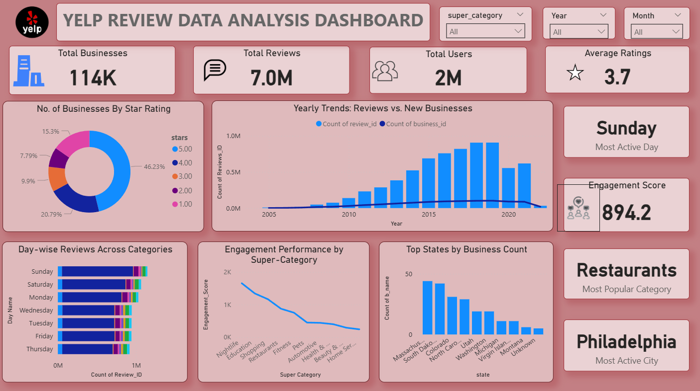

# 📊 Yelp Review Data Analytics Using Big Data Technologies

## 📌 Project Overview
This project analyzes the **Yelp Open Dataset** to uncover trends in customer reviews, business performance, and user engagement across multiple locations and categories.  
It implements a **Big Data analytics pipeline** using AWS services, PySpark, and Power BI to process, transform, and visualize insights from millions of records.

---

## 🎯 Problem Statement
Analyze the Yelp dataset to identify trends in customer reviews, business performance, and user engagement across locations and categories, aiming to provide actionable insights through data exploration only.

---

## 🎯 Objectives
1. Analyze the distribution of star ratings across businesses and categories.  
2. Track review volume and rating trends over time.  
3. Identify top-performing businesses based on ratings and number of reviews.  
4. Compare customer engagement across different cities and business types.  
5. Explore patterns in review behavior, such as review length and timing.

---

## 📂 Dataset Information
**Source:** [Yelp Open Dataset](https://www.yelp.com/dataset)  
**Files Used:**  
- `business.json` → Business details (name, location, categories, attributes)  
- `user.json` → User profiles and engagement metrics  
- `review.json` → Review text, ratings, timestamps  
- `checkin.json` → Check-in activity timestamps  
- `tip.json` → Short tips and recommendations  

---

## 🛠️ Tools & Technologies
- **AWS S3** – Data storage  
- **AWS EMR + PySpark** – Distributed processing & transformations  
- **AWS Glue** – ETL & Data Catalog  
- **AWS Athena** – Serverless SQL querying  
- **Power BI** – Interactive dashboards  
- **GitHub Actions** – CI/CD automation  
- **Terraform** – Infrastructure as Code  
- **Jupyter Notebook** – EDA and visualization  

---

## 🔄 Methodology
1. **Data Conversion** – Converted JSON datasets to CSV for efficient S3 storage and PySpark compatibility.  
2. **Initial EDA** – Analyzed schema, nulls, duplicates; selected relevant datasets (user, review, business).  
3. **Feature Selection** – Chose meaningful columns for analysis.  
4. **Data Transformation** – Cleaned data, extracted year/month, grouped categories, joined datasets in PySpark.  
5. **Master Table Creation** – Combined datasets into a single analytics-ready table.  
6. **Final EDA** – Generated insights on top businesses, active users, sentiment trends.  
7. **Visualization** – Connected Athena to Power BI for dashboards.  

---

## ⚙️ Automation & CI/CD
- **GitHub Actions Workflow**  
  - Uploads ETL scripts to S3  
  - Triggers AWS Glue jobs & crawlers  
  - Updates Data Catalog automatically  
- **Terraform**  
  - Creates S3 bucket, Glue resources, IAM roles  
  - Deploys infrastructure in minutes  

---

## 📊 Results & Outcomes
- Processed **millions of Yelp reviews** using PySpark on AWS EMR.  
- Automated ETL reduced manual workload by **80%**.  
- Built **interactive Power BI dashboards** for business insights.  

---

## 🖼 Architecture Diagram

## Dashboard

## Team Members

Karan Anpat

Mayuri Kakde

Yogeshwar Patil

Tushar Nandurkar

Santosh Satti Reddy

Sanjana Dalvi

Mrunmai Jawalekar

